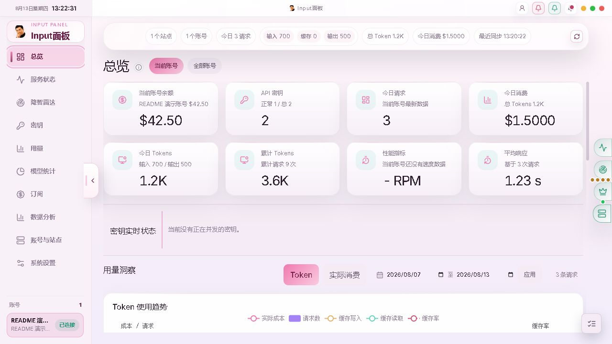
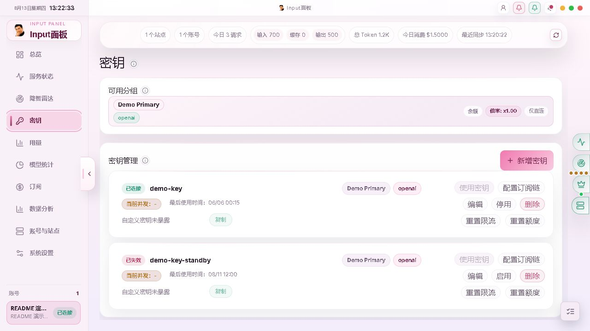
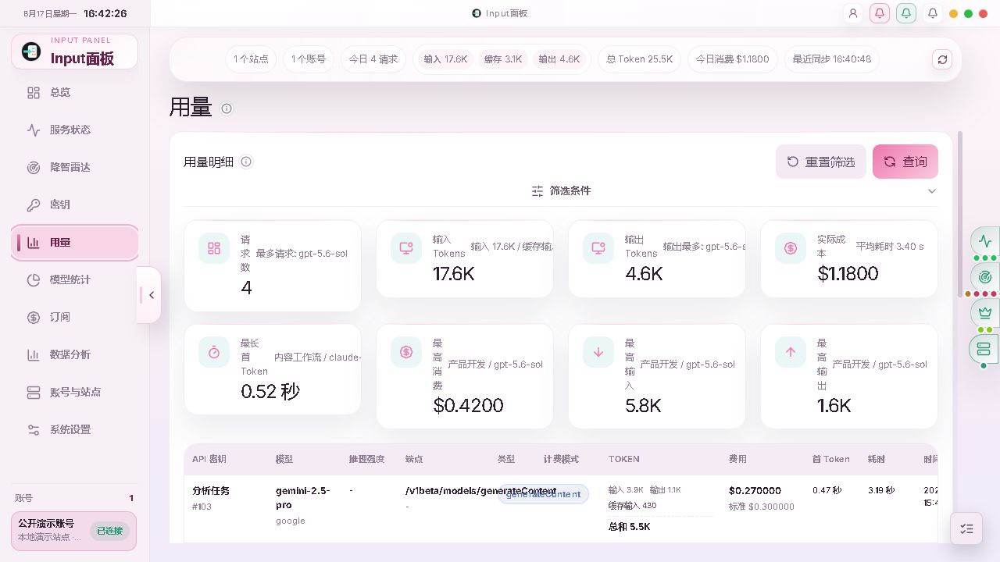
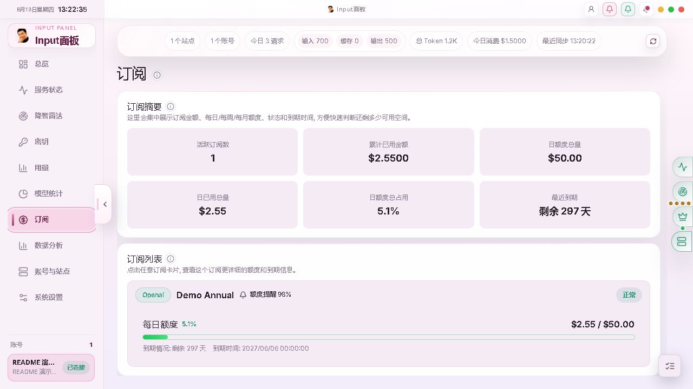
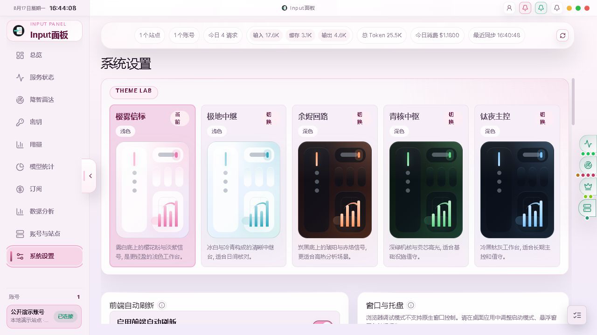

<div align="center">


# Input Panel

[](https://v2.tauri.app/)
[](https://www.rust-lang.org/)
[](https://react.dev/)
[](https://www.typescriptlang.org/)
[](https://www.sqlite.org/)

**Sub2API 多站点、多账号本地工作台**

集中查看账号、密钥、用量、模型统计、订阅与服务状态, 并通过桌面悬浮窗口持续掌握关键变化.

</div>

---

## 项目概述

Input Panel 面向需要同时管理多个 Sub2API 站点与账号的个人用户. 它将分散的账号状态、用量数据、订阅额度和公共服务信息汇总到一个本地工作台, 并使用 SQLite 持久化业务状态、缓存与同步进度.

项目采用 `Tauri 2 + Rust + React 19` 架构. 浏览器调试态与桌面态复用同一套 Rust application services、contracts 和 SQLite 存储, 避免维护两套业务后端; Tauri 桌面态额外提供原生窗口、系统托盘、单实例、后台调度和通知 mailbox.

> [!NOTE]
> Input Panel 是 Sub2API 的本地管理工作台, 不是 Sub2API 服务端或 API 网关的替代部署.

## 核心功能

| 功能 | 说明 |
| --- | --- |
| 多站点与多账号 | 配置多个 Sub2API 站点, 管理账号登录、会话、切换、同步与连通性状态 |
| 总览与提醒 | 汇总账号统计、实时指标、近期趋势、业务提醒和 Codex Radar 摘要 |
| 密钥管理 | 查看 API Key、状态、用量与可用分组, 支持相关上游分组操作 |
| 用量与模型分析 | 查询 usage history, 按条件筛选, 查看模型统计、趋势和消费明细 |
| 订阅管理 | 查看 subscriptions 与 quota windows, 配置按 Key 生效的节点化自动切换链 |
| 公共服务数据 | 无账号时也可查看公共服务状态, 并读取 Codex Radar IQ、intelligence 与 Fast 数据 |
| 桌面多窗口 | 提供主工作台、悬浮球、悬浮面板和悬浮通知四类窗口, 支持托盘与单实例唤醒 |
| 系统管理 | 管理桌面偏好、自动刷新、后台调度、SQLite 存储目录迁移与运行数据清理 |

## 功能界面

以下截图来自隔离的本地 mock 演示环境, 展示浏览器工作台已加载的真实页面数据; 不包含真实账号或凭据.

### 总览



### 密钥管理



### 用量明细



### 订阅额度



### 系统设置



## 技术栈

| 层级 | 技术 |
| --- | --- |
| 桌面运行时 | Tauri 2.11, Rust 2021 edition, Tokio |
| 前端 | React 19, TypeScript 5.8, Vite 6, ECharts 6, Lucide |
| 状态管理 | Zustand 5 |
| HTTP 与上游访问 | Axum 0.7, Reqwest 0.12 |
| 本地存储 | SQLite, rusqlite 0.31 |

---

## 快速开始

### 环境要求

- Windows 与 PowerShell 7
- Node.js、pnpm 与 Rust toolchain 1.77.2 或更高版本
- [Tauri 2 Windows 开发依赖](https://v2.tauri.app/start/prerequisites/)

### 安装依赖

```powershell
git clone https://github.com/xxxxxgold/input-panel.git
Set-Location input-panel
pnpm install --frozen-lockfile
```

### 浏览器联调

推荐使用仓库的受控启动入口:

```powershell
.\start-dev.cmd
```

也可以分别启动 Rust HTTP adapter 与 Vite:

```powershell
pnpm dev:server
pnpm dev:ui
```

默认服务地址:

| 服务 | 地址 |
| --- | --- |
| 前端 | `http://127.0.0.1:5777` |
| 后端健康检查 | `http://127.0.0.1:5559/api/health` |

需要显式替换已有受控实例并打开前后端输出窗口时, 使用:

```powershell
.\一键重启前后端.cmd
```

### 桌面开发

```powershell
pnpm dev
```

需要在浏览器中运行完整 Rust 业务链路与 headless scheduler 时, 使用:

```powershell
pnpm dev:web
```

### 启动方式说明

| 入口 | 适用场景 | 运行边界 |
| --- | --- | --- |
| `.\start-dev.cmd` | 日常浏览器联调 | 获取当前仓库开发租约, 启动 Vite 与 Rust HTTP adapter |
| `.\一键重启前后端.cmd` | 可见日志窗口与显式重启 | 替换已有受控实例, 分别打开前后端常驻窗口 |
| `pnpm dev:web` | 非受控的浏览器真实链路 | 启动 Browser HTTP adapter 与 headless scheduler |
| `pnpm dev` | Tauri 桌面开发 | 启动原生窗口、tray、single-instance、scheduler 与 notification mailbox |
| `pnpm dev:ui` | 仅调试前端 | 只启动 Vite, 需要已有可用后端 |

> [!IMPORTANT]
> 开发租约只覆盖两个 `.cmd` 启动入口. `pnpm dev`、`pnpm dev:web`、`pnpm dev:ui` 与独立 Vite 进程需要人工管理, 不应并行占用同一端口. Vite 遇到端口冲突会直接失败, 不会自动改绑.

> [!NOTE]
> 浏览器模式可以验证 HTTP adapter、Rust application services、SQLite 与页面链路, 但不能证明 tray、single-instance、原生窗口、Tauri scheduler 或 notification mailbox 已运行.

## 桌面构建与启动

构建调试可执行文件:

```powershell
pnpm build:desktop:debug
```

输出位置:

```text
src-tauri/target/debug/app.exe
```

构建 release 可执行文件:

```powershell
pnpm build:desktop
```

输出位置:

```text
src-tauri/target/release/app.exe
```

启动已有调试包:

```powershell
.\一键启动.cmd
```

> [!IMPORTANT]
> `一键启动.cmd` 以 `src-tauri/target/debug/app.exe` 为启动目标. 首次使用前请先运行 `pnpm build:desktop:debug`.

构建前, `scripts/prepare-desktop-build.ps1` 会释放目标 `app.exe` 的文件锁, 避免 Windows 因正在运行的旧进程而拒绝覆盖产物.

## 验证命令

```powershell
pnpm lint
pnpm build:web
cargo check --manifest-path src-tauri/Cargo.toml
pnpm build:desktop
```

## 项目结构

```text
src/                            React UI、页面壳层、feature client 与 workspace hooks
src-tauri/src/                  Rust adapters、application、contracts 与 infrastructure
src-tauri/examples/inputApi.rs  Browser HTTP adapter 入口
src-tauri/icons/                桌面与移动平台图标套件
src-tauri/resources/            桌面运行时资源
scripts/                        Windows 启动、生命周期与桌面构建辅助脚本
img/                            README 功能截图
THIRD_PARTY_LICENSES/           随源码分发的第三方许可证文本
```

### 关键入口

| 入口 | 文件 |
| --- | --- |
| 主工作台 | `src/app/MainWindowApp.tsx` |
| 多窗口兼容路由 | `src/App.tsx` |
| 浏览器入口 | `src/main.tsx` |
| 悬浮球入口 | `src/floating-orb-main.tsx` |
| 悬浮面板入口 | `src/floating-panel-main.tsx` |
| 悬浮通知入口 | `src/floating-notification-main.tsx` |
| Browser HTTP backend | `src-tauri/examples/inputApi.rs` |
| Tauri 桌面运行入口 | `src-tauri/src/lib.rs` |

## 运行边界

| 能力 | Browser 调试态 | Tauri 桌面态 |
| --- | --- | --- |
| React 工作台 | 支持 | 支持 |
| Rust application services | 通过 `/api/*` | 通过 Tauri command |
| SQLite | web scope | desktop scope |
| 主窗口与悬浮窗口 | 仅渲染浏览器页面 | 原生四窗口 |
| tray 与 single-instance | 不支持 | 支持 |
| Tauri scheduler | 不支持 | 支持 |
| notification mailbox 与原生通知 | 不支持完整生命周期 | 支持 |

所有 React feature client 统一通过 `src/shared/transport/runtime.ts` 选择 HTTP 或 Tauri transport. 两种 transport 共用 Rust 业务服务与 contracts, 不应各自复制业务规则.

服务状态页由本地 React 页面渲染, 通过 `/api/service-status` 或 `get_service_status` 获取数据, 不嵌入远端 iframe. 顶部完整通知列表由消息盒子弹窗承载, 主工作台 shell 以 `src/app/MainWindowApp.tsx` 为准.

## 本地存储与安全

| 运行范围 | 默认数据库路径 |
| --- | --- |
| Browser | `%USERPROFILE%\input_panel\web\config.sqlite` |
| Desktop | `%USERPROFILE%\input_panel\exe\config.sqlite` |
| `SUB2API_APP_ROOT` 隔离运行 | `<root>\config\config.sqlite` |

- 普通 web 与 desktop scope 会在各自默认目录旁读取 `storage.json`, 用它定位自定义数据库目录; 数据库文件名始终为 `config.sqlite`.
- 页面主数据来自 SQLite 缓存与读模型. `storage.json` 只保存数据库目录指针, 不承载业务状态.
- 系统设置支持选择用户目录、程序目录或绝对目标目录. 迁移使用 SQLite online backup 并保留源库; 成功后必须重启 Rust 后端或桌面应用, 不支持进程内热切换.
- 当前 `credentials.password` 会以明文写入本机 SQLite, 不是加密存储. 数据库、日志和截图都应按敏感资料处理.

> [!WARNING]
> 本地存储不等于加密存储. 在共享电脑、备份目录或云同步目录中使用自定义数据库路径前, 请先评估凭据暴露风险.

## 许可证

Input Panel 由 xxxxxgold 以 [GNU General Public License v3.0 only](./LICENSE) 发布.

```text
Copyright (C) 2026 xxxxxgold
SPDX-License-Identifier: GPL-3.0-only
```

第三方组件及其许可证见 [THIRD_PARTY_NOTICES.md](./THIRD_PARTY_NOTICES.md), 正式资产的来源、生成方式和哈希见 [ASSET_PROVENANCE.md](./ASSET_PROVENANCE.md).
